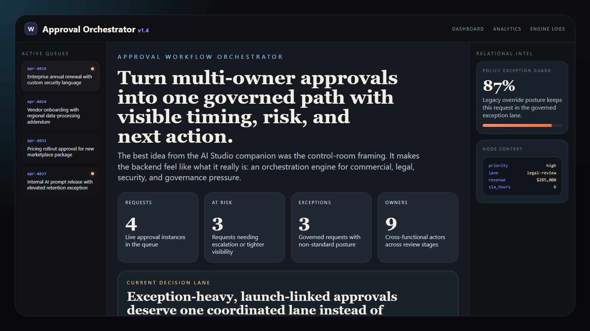
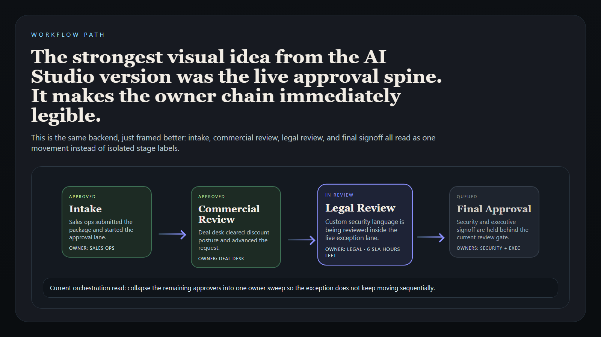
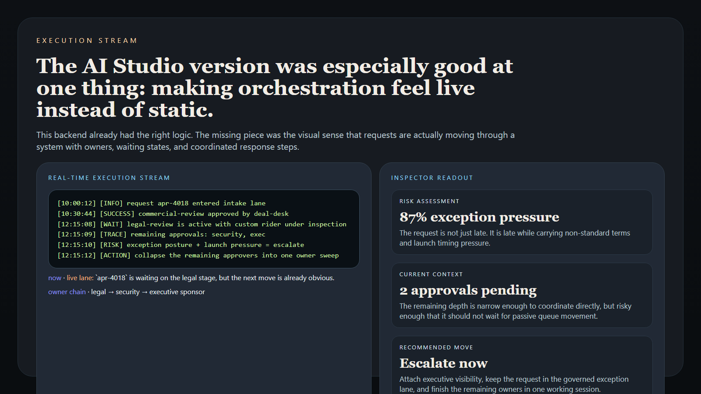
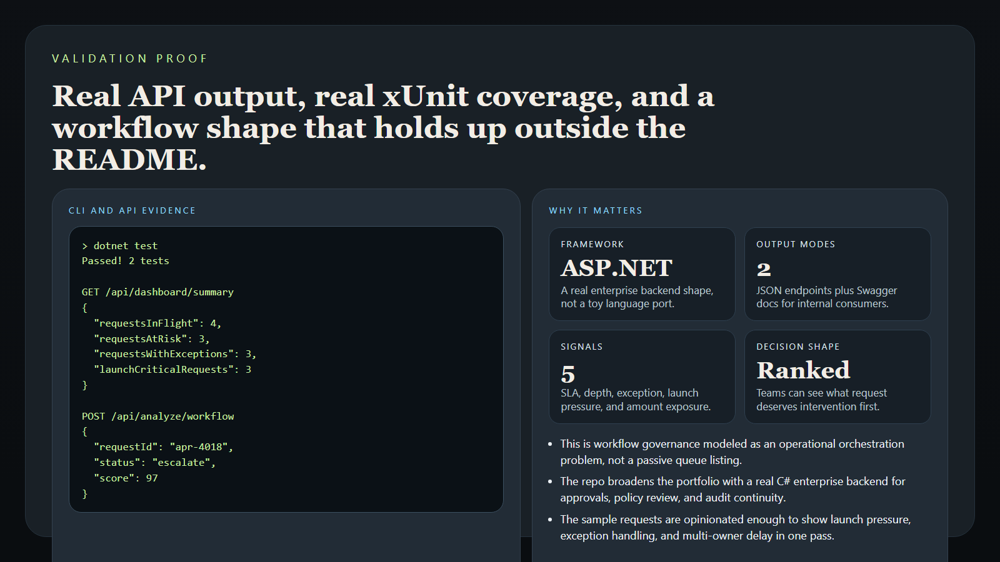

# Approval Workflow Orchestrator

> **C# / ASP.NET Core enterprise workflow project** for approval routing, SLA-aware escalation, policy review, and audit-history visibility.

**Portfolio takeaway:** *"Approvals only become trustworthy when timing, policy pressure, risk, and ownership are visible in the same control path."*

---

## Project Overview

| Attribute | Detail |
|---|---|
| **Language** | C# |
| **Framework** | ASP.NET Core 8 |
| **Runtime Shape** | HTTP API |
| **Domain** | Enterprise approvals and escalation governance |
| **Core Concerns** | routing · SLA pressure · exception review · audit history |
| **Primary Users** | finance ops · legal · security · revops · procurement |

---

## Executive Summary

Approval Workflow Orchestrator models the kind of internal service teams use when a request has to move through multiple owners without disappearing into inboxes, chat threads, or spreadsheet tracking. The API models approval requests, tracks current stages, scores workflow pressure, and returns next actions based on timing, policy exceptions, approval backlog, and request criticality.

The point of the repo is not generic CRUD. It shows how a C# backend can express enterprise workflow discipline: rank the risk, surface the stall, attach the owner, and make the next move obvious before the request misses the business moment.

---

## Workflow Shape

```text
request enters orchestration lane
             |
             +--> stage ownership
             +--> SLA pressure
             +--> policy exception review
             +--> approval dependency check
             +--> audit trail expansion
             |
             v
ranked workflow report + next action
```

---

## API Surface

| Endpoint | Purpose |
|---|---|
| `GET /` | service status and route guide |
| `GET /health` | health response |
| `GET /api/requests` | list sample approval requests |
| `GET /api/requests/{id}` | inspect one request |
| `GET /api/dashboard/summary` | workflow pressure summary |
| `POST /api/analyze/workflow` | score an approval request |
| `GET /docs` | Swagger UI |

---

## Analysis Signals

### SLA Pressure

- how close the request is to missing its expected response window
- whether escalation should happen now instead of later

### Approval Dependency Depth

- how many approvals are still open
- whether the current stage is blocked by a prior owner

### Policy Exception Risk

- whether the request is moving with non-standard terms
- whether legal, security, or procurement needs a tighter review lane

### Revenue or Delivery Impact

- whether the request is attached to a live commercial, product, or launch event
- whether delay is turning into measurable business drag

---

## Screenshots

### Control Room



### Workflow Path



### Execution Stream



### Proof Layer



---

## Sample Request Shape

```json
{
  "id": "apr-4018",
  "title": "Enterprise annual renewal with custom security language",
  "businessDomain": "revenue-operations",
  "priority": "high",
  "currentStage": "legal-review",
  "requestAmount": 285000,
  "slaHoursRemaining": 6,
  "requiredApprovalsPending": 2,
  "hasPolicyException": true,
  "launchCritical": true
}
```

---

## Run Locally

### Start the API

```bash
dotnet run --project ApprovalWorkflowOrchestrator.Api
```

### Open the API Docs

```text
http://127.0.0.1:5098/docs
```

### Run the Tests

```bash
dotnet test
```

---

## Industry Applications

### Revenue Operations

- route discount, exception, and renewal approvals without losing the owner chain
- surface commercial delay before it becomes forecast risk

### Security and Legal

- tighten review lanes when exception language or elevated risk posture appears
- preserve an audit trail across security, legal, and procurement handoffs

### Product and Platform

- coordinate launch-critical approvals where timing matters more than generic queue order
- stop cross-functional waits from silently blocking release or rollout plans

---

## What This Demonstrates

- C# added meaningfully through a real enterprise workflow backend
- ASP.NET Core used for operator-grade service design instead of boilerplate CRUD
- approval timing, policy pressure, and ownership modeled together
- Swagger, tests, and docs shaped for an actual internal platform repo

---

## Tech Stack

[](https://dotnet.microsoft.com/)
[](https://learn.microsoft.com/aspnet/core)
[](https://xunit.net/)
[](https://swagger.io/)

### Portfolio Links

- [LinkedIn](https://www.linkedin.com/in/mirzacausevic)
- [Kinetic Gain](https://kineticgain.com/)
- [Skills Page](https://mizcausevic.com/skills/)
- [GitHub](https://github.com/mizcausevic-dev)

---

*Part of [mizcausevic-dev's GitHub portfolio](https://github.com/mizcausevic-dev), with a focus on backend systems, workflow governance, revenue operations, and enterprise decision tooling.*
